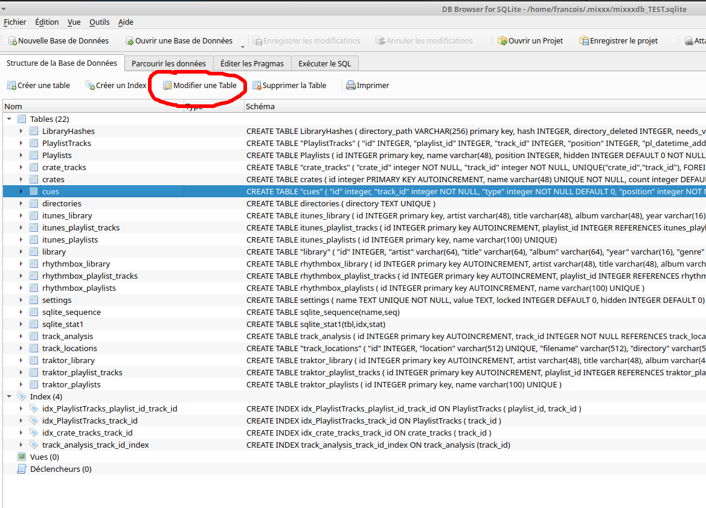
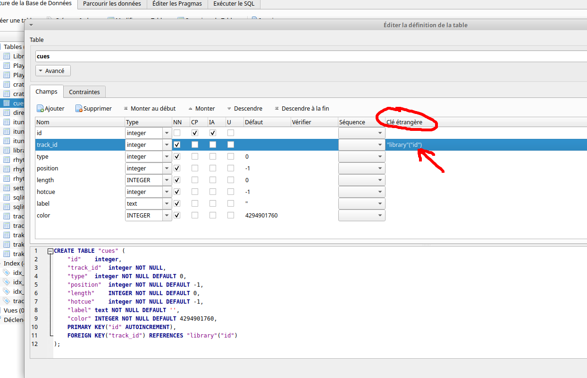

# Fixing Mixxx's Database

As mentionned in [this issue](https://github.com/mixxxdj/mixxx/issues/12328) several foreign key constraints defined in Mixxx's database are incorrect, and SQL Alchemy (Python's library) does not like it.

I fixed these quite easily using a GUI called "DB  Browser for SQlite" (`sqlitebrowser`).

**First** remove the foreign keys contraints check:

1. Click on "Edit Pragma"
2. Untick the "Foreign Keys" box

**Now** edit the foreign keys constraints of all the tables mentionned in [this issue](https://github.com/mixxxdj/mixxx/issues/12328). Here I take the example of the incorrect foreign key of the `cue` table:

1. Select the table and click on "Modify a Table"

2. Enlarge the new window so you can see "Foreign keys", then double click on the foreign key you want to edit (here there's only one) and simply change the values (here from `library_old` to `library`)

**Then**, to modify the default value of the `filetype` field of the `library` table:

1. Select the `library` table and click on "Modify a Table"
2. Find the row mentionning `filetype` and the "Default" column
3. Double click on the "?" then delete it to leave an empty field.

**Finally** you can reactivate the foreign key pragma (BTW if you use the [mixxxdb_cleanup.sql](https://github.com/mixxxdj/mixxx/blob/main/tools/mixxxdb_cleanup.sql) utility, you can now remove the `PRAGMA foreign_keys = OFF;` line):

1. Click on "Edit Pragma"
2. Tick the "Foreign Keys" box

Now you can save and close the database. And from now you're life will be very slightly better. :-)
